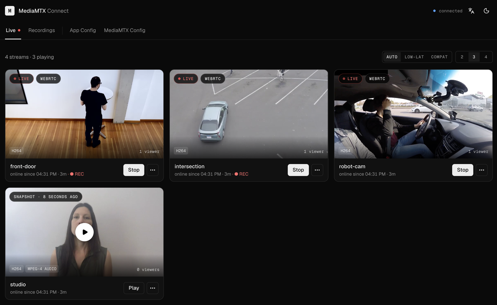

<div align="center">

<h1>MediaMTX Connect</h1>

<p><strong><a href="https://github.com/bluenviron/mediamtx">MediaMTX</a> のWeb UI。</strong><br>
ブラウザからライブ映像を見て、録画を探し、MediaMTX の設定を編集。</p>

<p>
  <a href="https://github.com/bcanfield/mediamtx-connect/actions"></a>
  <a href="https://github.com/bcanfield/mediamtx-connect/releases"></a>
  <a href="https://hub.docker.com/r/bcanfield/mediamtx-connect"></a>
  <a href="../../LICENSE"></a>
</p>



<details>
<summary>🌍 30の言語で読む</summary>
<p>
  🇺🇸 <a href="../../README.md">English</a> •
  🇪🇸 <a href="./README.es.md">Español</a> •
  🇨🇳 <a href="./README.zh.md">中文</a> •
  🇮🇹 <a href="./README.it.md">Italiano</a> •
  🇩🇪 <a href="./README.de.md">Deutsch</a> •
  🇷🇺 <a href="./README.ru.md">Русский</a> •
  🇫🇷 <a href="./README.fr.md">Français</a> •
  🇵🇹 <a href="./README.pt.md">Português</a> •
  🇯🇵 <strong>日本語</strong> •
  🇵🇱 <a href="./README.pl.md">Polski</a> •
  🇰🇷 <a href="./README.ko.md">한국어</a> •
  🇹🇷 <a href="./README.tr.md">Türkçe</a> •
  🇳🇱 <a href="./README.nl.md">Nederlands</a> •
  🇨🇿 <a href="./README.cs.md">Čeština</a> •
  🇹🇼 <a href="./README.zh-tw.md">繁體中文</a> •
  🇧🇷 <a href="./README.pt-br.md">Português (BR)</a> •
  🇮🇩 <a href="./README.id.md">Bahasa Indonesia</a> •
  🇷🇴 <a href="./README.ro.md">Română</a> •
  🇸🇪 <a href="./README.sv.md">Svenska</a> •
  🇩🇰 <a href="./README.da.md">Dansk</a> •
  🇳🇴 <a href="./README.no.md">Norsk</a> •
  🇫🇮 <a href="./README.fi.md">Suomi</a> •
  🇬🇷 <a href="./README.el.md">Ελληνικά</a> •
  🇭🇺 <a href="./README.hu.md">Magyar</a> •
  🇺🇦 <a href="./README.uk.md">Українська</a> •
  🇻🇳 <a href="./README.vi.md">Tiếng Việt</a> •
  🇵🇭 <a href="./README.tl.md">Tagalog</a> •
  🇹🇭 <a href="./README.th.md">ไทย</a> •
  🇮🇳 <a href="./README.hi.md">हिन्दी</a> •
  🇧🇩 <a href="./README.bn.md">বাংলা</a>
</p>
</details>

</div>

## これは何か

MediaMTX は優れたストリーミングサーバーですが、UI がありません。Connect はその欠けたフロントエンドです。MediaMTX の API と会話するコンテナ1つが、それをカメラウォール、録画アーカイブ、設定エディタに変えてくれます。

置き換えではなく相棒です。どの画面も MediaMTX がすでに公開しているものに対応します。path、API エンドポイント、`runOn*` フック、ネイティブに提供するプロトコル。映像は保存せず、メディアも中継せず、データベースも持ちません。

## クイックスタート

マルチアーキテクチャのイメージ（`linux/amd64`、`linux/arm64`）。Docker が適切なものを取得します。

**すでに MediaMTX が動いている場合** — その隣に Connect を追加します。

```bash
docker run -d \
  -p 3000:3000 \
  -e BACKEND_SERVER_MEDIAMTX_URL=http://<your-mediamtx-host> \
  -e REMOTE_MEDIAMTX_URL=http://<host-your-browser-uses> \
  -v /path/to/recordings:/recordings \
  -v mediamtx-connect-data:/data \
  -v mediamtx-connect-screenshots:/screenshots \
  bcanfield/mediamtx-connect:latest
```

**ゼロから始める場合** — 同梱の compose が Connect をビルドし、MediaMTX の隣で起動します。

```bash
git clone https://github.com/bcanfield/mediamtx-connect.git
cd mediamtx-connect
docker compose up -d
```

あとは <http://localhost:3000> を開くだけです。

> [!IMPORTANT]
> Connect は `mediamtx.yml` に `api: yes` が必要です。[同梱の設定](../../mediamtx.yml)はそのまま動きます。

## 得られるもの

### ライブビュー

MediaMTX が把握しているすべての path を、2〜4列のグリッドで。

- **カードごとに WebRTC か HLS。** `AUTO` は黙ってフォールバックし、`LOW-LAT` は WebRTC を要求し、`COMPAT` は HLS を強制します。各カードは実際に確立できたトランスポートを表示します。
- **停止中もスナップショット。** バックグラウンドジョブが各カードに最近のフレームを保ち、その経過時間をピルに出します。今すぐ新しいものが欲しければ、カードのメニューから撮れます。
- **ライブのテレメトリ。** コーデック、視聴者数、稼働時間を path 一覧からそのまま表示。
- **正直な録画状態。** カードはそのストリームが*実際に*録画中かを示します。Connect が読めなかった状態はオフではなく不明と表示します。
- **配信 URL をクリップボードへ。** RTSP・RTMP・SRT を、サーバー自身のリッスンアドレスから組み立てます。各 path のページにはさらに配信・視聴パネルがあり、WHIP、WHEP、HLS、TLS 版を含むサーバーが提供するすべてのプロトコルを、すぐコピーできる ffmpeg・GStreamer・OBS・ffplay・VLC のスニペット付きで表示します。

### 録画

- MediaMTX の再生サーバーから得た、ストリームごとの1日のタイムライン。録画された区間とその間の空白を示し、どの区間も再生できます。再生が無効なら、Connect は必要な設定変更を正確に列挙し、ワンクリックで適用します。
- クリップのダウンロード。最大1時間までの任意の範囲（または直近の5分、15分、1時間）を1本のプレーンな MP4 として取得でき、MediaMTX が再エンコードなしでセグメントをまたいでつなぎ合わせます。
- ストリームごとの MP4 または MPEG-TS セグメントを日付ごとにまとめ、サムネイルは自動生成。
- その場で展開するインラインプレーヤー。HTTP Range リクエストでシークできます。
- 進捗表示とキャンセル付きのストリーミングダウンロード。
- `/` を押せば絞り込めます。

### セッション

- **接続中の全員を1つの表で。** RTSP、RTSPS、RTMP、RTMPS、SRT、WebRTC、HLS の配信者と視聴者を、リモートアドレス、送受信バイト数、接続時間とともに表示し、5秒ごとに更新します。
- **クライアントを切断**（確認あり）。再接続は可能で、切断は利用禁止ではありません。

### YAML なしの設定

- **サーバー設定:** Logging、API、Authentication、Hooks、RTSP、RTMP、HLS、WebRTC、SRT にまたがる、型付き・検証付きの66個のコントロール。
- **path デフォルトと path ごとのオーバーライド**を、MediaMTX が提供しているスコープで。ワイルドカード配下のストリームを保存すると疎なエントリが書かれ、触っていないキーはデフォルトに追従し続けます。
- **path カタログ。** ライブと正規表現のバッジ、ガイド付きの「RTSP カメラを追加」フォーム、そしてどの path でも独自エントリの差し戻しや削除が可能です（誰かが接続中なら警告あり）。
- **各 path のページでライブの健全性:** トラック、視聴者、転送バイト数、エラーフレーム、稼働時間を5秒ごとに更新。何も配信していない path は故障ではなくアイドルと表示されます。
- **各 path の耐障害性:** カメラが落ちている間オフライン用クリップをループ再生する常時利用可能なフォールバックと、誰かが視聴している間だけソースを開くオンデマンド取得。
- **すべての `runOn*` フック。** 保存すると path が再起動する箇所には警告が出ます。
- **転送:** MediaMTX ネイティブの `forward` リストを通じて、path を YouTube、Twitch、または別のサーバーへ送出。ストリームキーは伏せられ、path の再起動もありません。
- **疎な書き込み。** 変更したキーだけが送信されます。

### 運用

API・SPA・メディアを1プロセスで · マルチアーキテクチャ · `GET /api/health` · ヘッダーに MediaMTX のバージョン · 構造化ログ · PWA としてインストール可能 · ダークとライト · 30言語 · データベース不要。

## 環境変数

初回起動の初期値を与えるだけです。あとはすべて **Config** から変更できます。

| 変数 | イメージでの既定値 | 用途 |
|----------|---------|---------|
| `BACKEND_SERVER_MEDIAMTX_URL` | `http://mediamtx` | Connect が MediaMTX API に到達する先 |
| `MEDIAMTX_API_PORT` | `9997` | MediaMTX API のポート |
| `REMOTE_MEDIAMTX_URL` | `http://localhost` | *ブラウザ*が再生のために MediaMTX に到達する先。ブラウザがサーバー上にない場合は必ず設定してください |
| `MEDIAMTX_RECORDINGS_DIR` | `/recordings` | Connect が録画を読む場所 |
| `MEDIAMTX_SCREENSHOTS_DIR` | `/screenshots` | スナップショットとサムネイルの保存先 |
| `DATA_DIR` | `/data` | `config.json` の置き場所 |
| `PORT` | `3000` | HTTP ポート |
| `LOG_LEVEL` | `info` | Pino のログレベル |

`http://mediamtx` は同梱 compose のネットワーク上でしか解決しません。単独の `docker run` では自分のホストを指定してください。compose では `REMOTE_MEDIAMTX_URL` の代わりに `.env` で `REMOTE_MEDIAMTX_HOST` を設定します。これは MediaMTX が広告する WebRTC ホストも設定します。各変数の説明は [`.env.example`](../../.env.example) にあり、`pnpm dev` は `.env` なしで localhost の既定値を使います。

## 仕組み

```
Browser ──HLS / WebRTC (WHEP)──────────────────────────┐
   │                                                   │
   │ oRPC (typed)                                      ▼
   ▼                                              ┌──────────┐
┌─────────────────────┐    MediaMTX HTTP API      │ MediaMTX │
│ mediamtx-connect    │ ────────────────────────▶ │  server  │
│ Hono API + React SPA│                           └──────────┘
└─────────────────────┘                                │
   │ reads                                             │ writes
   ▼                                                   ▼
recordings/ + screenshots/  ◀────────────────────  MP4 segments
```

ライブ再生はブラウザから MediaMTX へ直接。Connect が運ぶのは JSON と、録画・サムネイルです。ディスクから読むか、MediaMTX の再生サーバーから録画区間を中継します。

## ドキュメント

| | |
|---|---|
| [機能一覧](../../docs/FEATURES.md) | 出荷済みのすべての機能・ルート・プロシージャ |
| [アーキテクチャ](../../docs/ARCHITECTURE.md) | 各部品のつながり |
| [コントリビュート](../../CONTRIBUTING.md) | 開発環境、スクリプト、PR の流れ |
| [サンプル](../../examples/) | Raspberry Pi カメラ、テスト用のダミーストリーム |

## コントリビュート

Issue も PR も歓迎です。`pnpm install && pnpm dev` でサンプルデータ入りのフルスタックが立ち上がります。詳しくは [CONTRIBUTING.md](../../CONTRIBUTING.md) を参照してください。PR タイトルは conventional commits に従います。私たちは[行動規範](../../CODE_OF_CONDUCT.md)を守っています。

## ライセンス

[MIT](../../LICENSE)
