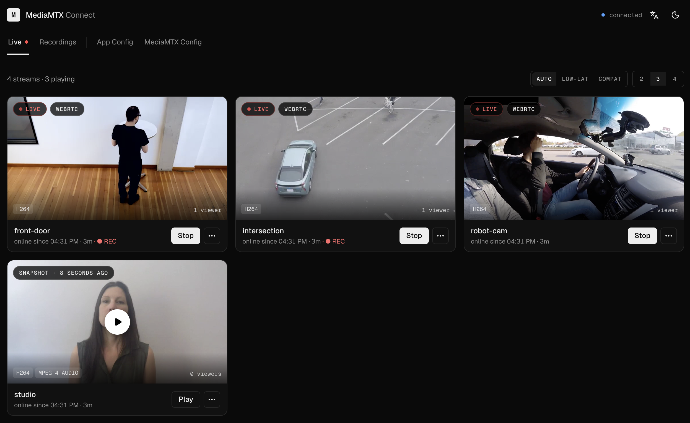

<div align="center">

<h1>MediaMTX Connect</h1>

<p><strong>Веб-интерфейс для <a href="https://github.com/bluenviron/mediamtx">MediaMTX</a>.</strong><br>
Смотрите трансляции, просматривайте записи, правьте любой ключ конфигурации — прямо в браузере.</p>

<p>
  <a href="https://github.com/bcanfield/mediamtx-connect/actions"></a>
  <a href="https://github.com/bcanfield/mediamtx-connect/releases"></a>
  <a href="https://hub.docker.com/r/bcanfield/mediamtx-connect"></a>
  <a href="../../LICENSE"></a>
</p>



<details>
<summary>🌍 Читать на 30 языках</summary>
<p>
  🇺🇸 <a href="../../README.md">English</a> •
  🇪🇸 <a href="./README.es.md">Español</a> •
  🇨🇳 <a href="./README.zh.md">中文</a> •
  🇮🇹 <a href="./README.it.md">Italiano</a> •
  🇩🇪 <a href="./README.de.md">Deutsch</a> •
  🇷🇺 <strong>Русский</strong> •
  🇫🇷 <a href="./README.fr.md">Français</a> •
  🇵🇹 <a href="./README.pt.md">Português</a> •
  🇯🇵 <a href="./README.ja.md">日本語</a> •
  🇵🇱 <a href="./README.pl.md">Polski</a> •
  🇰🇷 <a href="./README.ko.md">한국어</a> •
  🇹🇷 <a href="./README.tr.md">Türkçe</a> •
  🇳🇱 <a href="./README.nl.md">Nederlands</a> •
  🇨🇿 <a href="./README.cs.md">Čeština</a> •
  🇹🇼 <a href="./README.zh-tw.md">繁體中文</a> •
  🇧🇷 <a href="./README.pt-br.md">Português (BR)</a> •
  🇮🇩 <a href="./README.id.md">Bahasa Indonesia</a> •
  🇷🇴 <a href="./README.ro.md">Română</a> •
  🇸🇪 <a href="./README.sv.md">Svenska</a> •
  🇩🇰 <a href="./README.da.md">Dansk</a> •
  🇳🇴 <a href="./README.no.md">Norsk</a> •
  🇫🇮 <a href="./README.fi.md">Suomi</a> •
  🇬🇷 <a href="./README.el.md">Ελληνικά</a> •
  🇭🇺 <a href="./README.hu.md">Magyar</a> •
  🇺🇦 <a href="./README.uk.md">Українська</a> •
  🇻🇳 <a href="./README.vi.md">Tiếng Việt</a> •
  🇵🇭 <a href="./README.tl.md">Tagalog</a> •
  🇹🇭 <a href="./README.th.md">ไทย</a> •
  🇮🇳 <a href="./README.hi.md">हिन्दी</a> •
  🇧🇩 <a href="./README.bn.md">বাংলা</a>
</p>
</details>

</div>

## Что это

MediaMTX — отличный стриминговый сервер без интерфейса. Connect — недостающий фронтенд: один контейнер, который говорит с API MediaMTX и превращает его в стену камер, архив записей и редактор конфигурации.

Это спутник, а не замена. Каждый экран опирается на то, что MediaMTX уже отдаёт: path, эндпоинт API, хук `runOn*`, протокол, который он раздаёт нативно. Видео не хранит, медиа не проксирует, базы данных нет.

## Быстрый старт

Мультиархитектурные образы (`linux/amd64`, `linux/arm64`) — Docker скачает нужный.

**MediaMTX уже работает?** Поставьте Connect рядом:

```bash
docker run -d \
  -p 3000:3000 \
  -e BACKEND_SERVER_MEDIAMTX_URL=http://<your-mediamtx-host> \
  -v /path/to/recordings:/recordings \
  -v mediamtx-connect-data:/data \
  bcanfield/mediamtx-connect:latest
```

**Начинаете с нуля?** Встроенный compose поднимет оба:

```bash
git clone https://github.com/bcanfield/mediamtx-connect.git
cd mediamtx-connect
docker compose up -d
```

Затем откройте <http://localhost:3000>.

> [!IMPORTANT]
> Connect требует `api: yes` в вашем `mediamtx.yml`. [Приложенная конфигурация](../../mediamtx.yml) работает как есть.

## Что вы получаете

### Живой просмотр

Все path, которые знает MediaMTX, сеткой в 2–4 колонки.

- **WebRTC или HLS — для каждой карточки.** `AUTO` молча откатывается на HLS, `LOW-LAT` настаивает на WebRTC, `COMPAT` включает HLS — и каждая карточка показывает транспорт, который реально получила.
- **Снимки в простое.** Фоновая задача держит на каждой карточке свежий кадр, а его возраст — на бейдже.
- **Живая телеметрия.** Кодеки, число зрителей и время в эфире — прямо из списка path.
- **Честное состояние записи.** Карточки показывают, идёт ли запись *фактически*; состояние, которое Connect не смог прочитать, отмечено как неизвестное, а не как выключенное.
- **Ссылки для публикации в буфер обмена.** RTSP, RTMP и SRT, построенные из собственных listen-адресов сервера.

### Записи

- MP4 каждого потока, сгруппированные по дням, с автоматическими миниатюрами.
- Плеер, разворачивающийся прямо в строке, с перемоткой на HTTP Range-запросах.
- Потоковая загрузка с прогрессом и отменой.
- Нажмите `/`, чтобы отфильтровать.

### Конфигурация без YAML

- **Вся конфигурация сервера** — 65 типизированных и проверяемых элементов в Logging, API, Hooks, RTSP, RTMP, HLS, WebRTC и SRT.
- **Path defaults и переопределения для отдельных path** — в тех областях, откуда MediaMTX их отдаёт. Сохранение потока, покрытого шаблоном, пишет разреженную запись, поэтому нетронутые ключи продолжают наследоваться.
- **Все 15 хуков `runOn*`**, с предупреждением там, где сохранение перезапускает path.
- **Разреженная запись** — только изменённые ключи.

### Эксплуатация

Один процесс на API, SPA и медиа · мультиархитектурность · `GET /health` · структурированные логи · PWA · светлая и тёмная темы · 30 языков · без базы данных.

## Переменные окружения

Они задают лишь первый запуск. Дальше всё правится в **Config**.

| Переменная | По умолчанию | Назначение |
|----------|---------|---------|
| `BACKEND_SERVER_MEDIAMTX_URL` | `http://mediamtx` | Где Connect достаёт API MediaMTX изнутри своего контейнера |
| `MEDIAMTX_API_PORT` | `9997` | Порт API MediaMTX |
| `MEDIAMTX_RECORDINGS_DIR` | `./recordings` | Путь на хосте, смонтированный под записи (только compose) |
| `MEDIAMTX_SCREENSHOTS_DIR` | `/screenshots` | Где хранятся миниатюры |

`http://mediamtx` разрешается только в сети встроенного compose — для отдельного `docker run` укажите свой хост.

## Как это работает

```
Browser ──HLS / WebRTC (WHEP)──────────────────────────┐
   │                                                   │
   │ oRPC (typed)                                      ▼
   ▼                                              ┌──────────┐
┌─────────────────────┐    MediaMTX HTTP API      │ MediaMTX │
│ mediamtx-connect    │ ────────────────────────▶ │  server  │
│ Hono API + React SPA│                           └──────────┘
└─────────────────────┘                                │
   │ reads                                             │ writes
   ▼                                                   ▼
recordings/ + screenshots/  ◀────────────────────  MP4 segments
```

Воспроизведение идёт из браузера в MediaMTX. Connect передаёт только JSON плюс записи и миниатюры, которые читает с диска.

## Документация

| | |
|---|---|
| [Возможности](../FEATURES.md) | Все выпущенные возможности, маршруты и процедуры |
| [Архитектура](../../ARCHITECTURE.md) | Как складываются части |
| [Участие](../../CONTRIBUTING.md) | Настройка окружения, скрипты, процесс PR |
| [Примеры](../../examples/) | Камера Raspberry Pi, фейковые потоки для тестов |

## Участие

Issue и PR приветствуются. `pnpm install && pnpm dev` поднимает полный стек с тестовыми данными — см. [CONTRIBUTING.md](../../CONTRIBUTING.md); заголовки PR — conventional commits. Мы следуем [Кодексу поведения](../../CODE_OF_CONDUCT.md).

## Лицензия

[MIT](../../LICENSE)
